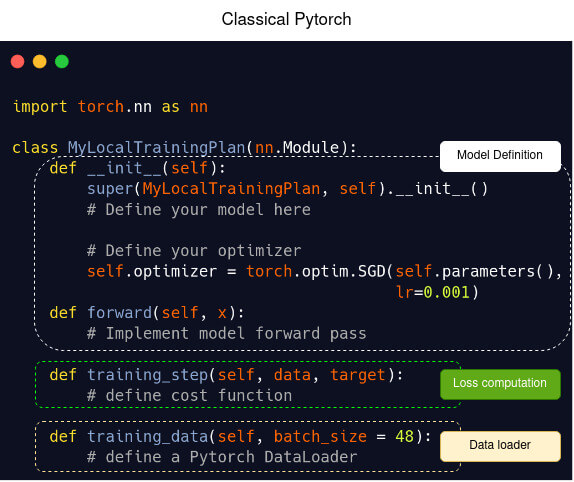
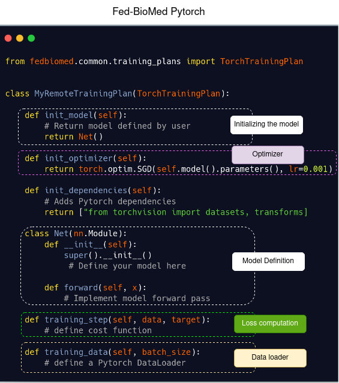
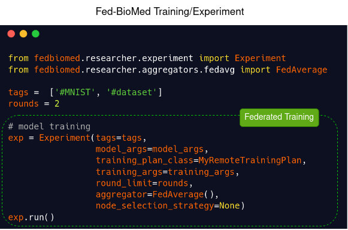

#  Basic Collaborative Learning Setup

Fed-BioMed enables users to quickly create a basic collaborative learning setup within seconds, providing an intuitive framework for exploring federated learning. This article serves as a comprehensive guide, walking you through the process of creating multiple nodes, designing a training plan for collaborative learning, and executing an experiment that performs model training.

## Setup your working directory

It is essential to set up a dedicated working directory in your local environment to organize all Fed-BioMed components. Additionally, create a `data` directory within the working directory to store the dataset that will be used in this guide.

## Create your nodes

The following two commands will create two node components. The directory that components will be initialized will be relative to the path that these commands are executed. Therefore, please make sure that you changed your directory to the working directory that you've created for Fed-BioMed.

```
fedbiomed component create -c node -p ./fbm-node
fedbiomed component create -c node -p ./fbm-second-node
```

## Deploy MNIST Dataset

The Fed-BioMed CLI comes with a predefined MNIST dataset configuration that automatically downloads the MNIST dataset and deploys it onto the nodes. The following commands will download the MNIST dataset into the `data` directory you created and deploy it to `my-node` and `my-second-node`.

```
fedbiomed node -p ./fbm-node dataset add --mnist ./data
fedbiomed node -p ./fbm-second-node dataset add --mnist ./data
```

## Start your Nodes

Please open a separate terminal window and start your nodes by running the appropriate commands for each node in their respective directories. For example:

1. For `fbm-node`, run:
   ```shell
   fedbiomed node start --path ./fbm-node
   ```

2. For `fbm-second-node`, run:
   ```shell
   fedbiomed node start --path ./fbm-second-node
   ```

Ensure each node is started in its own terminal window so that both can run concurrently.


## Researcher

The Researcher component is the central entity that orchestrates the collaborative learning experiment across multiple nodes by allowing users to define the training plan and experiment.

To create your Researcher component in the same working directory, execute the following command:

```shell
fedbiomed component create -c researcher
```

The command above will create a `fbm-researcher` folder in your working directory, where the Researcher component assets will be stored. By starting the Researcher component, you will launch a Jupyter Notebook that is configured to use the Researcher component created in your working directory.

To start the Researcher component, run the following command:

```shell
fedbiomed researcher start
```

This will open a Jupyter Notebook, allowing you to interact with the Researcher component and begin configuring your collaborative learning experiment.

### Create and train your Federated Learning model

Fed-BioMed does not require you to modify your machine learning models to perform collaborative learning. Instead, it requires you to create a training plan where you can integrate your existing model, optimizer, and training steps. The following example demonstrates how to define a training plan using an existing PyTorch model and training loop.

<br>
Template of a **model definition** in Pytorch (left) and in Fed-BioMed using Pytorch (right)
<br>

Classical Pytorch          | Fed-BioMed
:-------------------------:|:-------------------------:
   |  

<br><br>
Template of a **model training loop** in Pytorch (left) and in Fed-BioMed using Pytorch (right)

Classical Pytorch          | Fed-BioMed
:-------------------------:|:-------------------------:
   |  

## Executing your training

Once the Jupyter Notebook has started, you can define your training plan and set up your experiment. After configuring the necessary parameters, you can execute your experiment to initiate the collaborative learning process.


```python

import torch
import torch.nn as nn
import torch.nn.functional as F
from torchvision import datasets, transforms
from fedbiomed.common.training_plans import TorchTrainingPlan
from fedbiomed.common.data import DataManager


class MyRemoteTrainingPlan(TorchTrainingPlan):

    def init_model(self):
        return self.Net()

    def init_optimizer(self):
        return torch.optim.SGD(self.parameters(), lr=0.01)

    def init_dependencies(self):
        return ["from torchvision import datasets, transforms"]

    class Net(nn.Module):
        def __init__(self, model_args: dict = {}):
            super().__init__()
            self.in_features = 28*28
            self.out_features = 10
            self.fc1 = nn.Linear(self.in_features, 50)
            self.fc2 = nn.Linear(50, self.out_features)


        def forward(self, x):
            x = x.reshape(-1, 28*28)
            x = self.fc1(x)
            x = F.relu(x)
            x = self.fc2(x)
            output = F.log_softmax(x, dim=1)
            return output

    def training_step(self, data, target):
        output = self.forward(data)
        loss   = torch.nn.functional.nll_loss(output, target)
        return loss

    def training_data(self):
        # Custom torch Dataloader for MNIST data
        transform = transforms.Compose([transforms.ToTensor(),
        transforms.Normalize((0.1307,), (0.3081,))])
        mnist_dataset = datasets.MNIST(self.dataset_path,
                                       train=True,
                                       download=False,
                                       transform=transform)
        return DataManager(mnist_dataset,  shuffle=True)

```

Next, create your training arguments and experiment, then initiate collaborative learning using the two previously started nodes.

```python
model_args = {}

training_args = {
    'loader_args': {
        'batch_size': 48,
    },
    'epochs': 20,
    'dry_run': False,
}

from fedbiomed.researcher.federated_workflows import Experiment
from fedbiomed.researcher.aggregators.fedavg import FedAverage

tags =  ['#MNIST', '#dataset']
rounds = 2

# model training
exp = Experiment(tags=tags,
                 model_args=model_args,
                 training_plan_class=MyRemoteTrainingPlan,
                 training_args=training_args,
                 round_limit=rounds,
                 aggregator=FedAverage(),
                 node_selection_strategy=None)
exp.run()

# model saving
exp.training_plan().export_model('./my_trained_model')
```


## Going Further

Please visit the [Configuration Guide](./configuration.md) to learn more about using the Fed-BioMed CLI to initialize and manage Fed-BioMed components. The Configuration Guide will help you establish the basics of Fed-BioMed federated learning infrastructure needed to follow the tutorials provided in this documentation.

