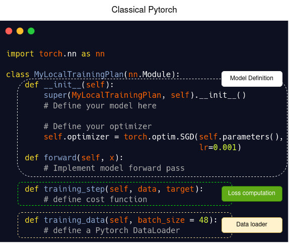
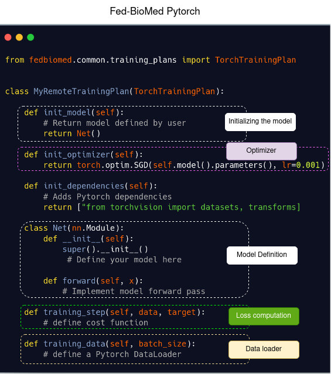
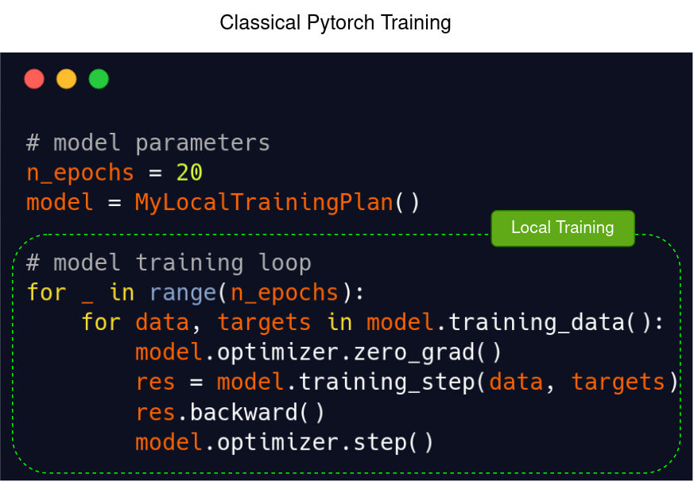
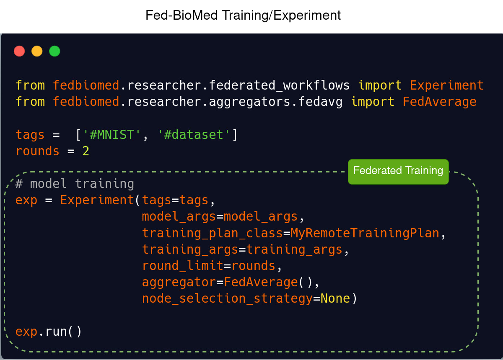

# Getting Started with Fed-BioMed - Fed-BioMed basic usage example


## `Network`
`Network` is the Fed-BioMed component that allows communication between the other components (`Researcher` and `Node`s). To launch a `Network`, open in a terminal (from the `Fed-BioMed` repository):

```shell
./scripts/fedbiomed_run network start
```
<br>


## `Node`
In Federated Learning, a `Node` is a component on which sensitive data are stored.  
To run a node, nothing simpler! From `Fed-BioMed` repository, enter the following command on a terminal:


```shell
./scripts/fedbiomed_run node start
```

Your `Node` is now running. Next steps will be to add into the `Node`any datasets, each of them specified with a `Tag`, allowing any `Researcher` to search for `Node`s with specific dataset to train his/her model on.
Further information about how to add data, how to configure your `Node`s and deploy it are given [`Node` subsection](../user-guide/nodes/configuring-nodes.md).

<br></br>

## `Researcher`

### 1. Launch your `Researcher` environment

The [`Researcher`](../user-guide/researcher/index.md) is the component used for designing and training Federated models. In a terminal, enter:

```shell
source ./scripts/fedbiomed_environment researcher
./scripts/fedbiomed_run researcher start
```

A jupyter-notebook will pop up, in which you can write your first Federated model.

<br>

### 2. Create and train your Federated Learning model

Models designed in Fed-BioMed using Pytorch are very similar to classic Pytorch models. 

Here we provide a code snippet in Pytorch (left) and its equivalent in Fed-BioMed (right). Basically, to define a Pytorch model in Fed-BioMed, create a class as you would do for a Pytorch model, and implement a `training_step` method for loss computation, a `training_data` method wrapping a `DataLoader` for data preprocessing. Finally select an `Aggregator` and a node selection strategy for Federated model training. `Researcher` have to specify on which dataset he/she wants to train their data using `tags`. That's all you have to know!

<br>
#### Template of a **model definition** in Pytorch (left) and in Fed-BioMed using Pytorch (right)

Classical Pytorch          | Fed-BioMed  
:-------------------------:|:-------------------------:
   |  

#### Template of a **model training loop** in Pytorch (left) and in Fed-BioMed using Pytorch (right)

Classical Pytorch          | Fed-BioMed  
:-------------------------:|:-------------------------:
   |   

## Basic Full Example (for jupyter-notebook)

We present here a Multilayer Perceptron model in classic Pytorch and its Federated equivalent in Fed-BioMed.

### Multilayer Perceptron in Pytorch: model definition

```python
import os

import torch
import torch.nn as nn
import torch.nn.functional as F
from torchvision import datasets, transforms
from torch.utils.data import Dataset, DataLoader


class MyLocalTrainingPlan(nn.Module): 
    def __init__(self):
        super(MyLocalTrainingPlan, self).__init__()
        self.in_features = 28 * 28
        self.out_features = 10
        
        self.fc1 = nn.Linear(self.in_features, 50)
        self.fc2 = nn.Linear(50, self.out_features)
        # optimizer parameters
        lr = 0.01
        self.optimizer = torch.optim.SGD(self.parameters(), lr=lr)

    def forward(self, x):
        x = x.reshape(-1, 28*28)
        x = self.fc1(x)
        x = F.relu(x)
        x = self.fc2(x)
        output = F.log_softmax(x, dim=1)
        return output

    def training_step(self, data, target):
        output = self.forward(data)
        loss   = torch.nn.functional.nll_loss(output, target)
        return loss

    def training_data(self):
        # Custom torch Dataloader for MNIST data
        transform = transforms.Compose([transforms.ToTensor(),
        transforms.Normalize((0.1307,), (0.3081,))])
        
        home = os.path.expanduser("~")
        path_file = os.path.join(home, 'data')
        mnist_dataset = datasets.MNIST(path_file, train=True,
                                       download=True, transform=transform)
        data_loader = torch.utils.data.DataLoader(mnist_dataset,
                                                  batch_size=48,                       
                                                   shuffle=True)
        return data_loader
```

### Multilayer Perceptron in Fed-BioMed with PyTorch: model definition (same example as previous one but transposed to Fed-BioMed Framework)


```python

import torch
import torch.nn as nn
import torch.nn.functional as F
from torchvision import datasets, transforms
from fedbiomed.common.training_plans import TorchTrainingPlan
from fedbiomed.common.data import DataManager


class MyRemoteTrainingPlan(TorchTrainingPlan): 
    
    def init_model(self):
        return self.Net()
    
    def init_optimizer(self):
        return torch.optim.SGD(self.parameters(), lr=0.01)
        
    def init_dependencies(self):
        return ["from torchvision import datasets, transforms"]
    
    class Net(nn.Module):
        def __init__(self, model_args: dict = {}):
            super().__init__()
            self.in_features = 28*28
            self.out_features = 10
            self.fc1 = nn.Linear(self.in_features, 50)
            self.fc2 = nn.Linear(50, self.out_features)
    
    
        def forward(self, x):
            x = x.reshape(-1, 28*28)
            x = self.fc1(x)
            x = F.relu(x)
            x = self.fc2(x)
            output = F.log_softmax(x, dim=1)
            return output
    
    def training_step(self, data, target):
        output = self.forward(data)
        loss   = torch.nn.functional.nll_loss(output, target)
        return loss

    def training_data(self):
        # Custom torch Dataloader for MNIST data
        transform = transforms.Compose([transforms.ToTensor(),
        transforms.Normalize((0.1307,), (0.3081,))])
        mnist_dataset = datasets.MNIST(self.dataset_path,
                                       train=True,
                                       download=False,
                                       transform=transform)
        return DataManager(mnist_dataset,  shuffle=True)

```

### Multilayer Perceptron in Pytorch: model training loop (same example as previous one but transposed to Fed-BioMed)

```python
# model parameters
n_epochs = 20


model = MyLocalTrainingPlan()

# model training
for _ in range(n_epochs):
    for data, targets in model.training_data():
        model.optimizer.zero_grad()
        res = model.training_step(data, targets)
        res.backward()
        model.optimizer.step()
```


### Multilayer Perceptron in Fed-BioMed with Pytorch: model training loop

```python
model_args = {}

training_args = {
    'loader_args': {
        'batch_size': 48,
    },
    'epochs': 20, 
    'dry_run': False,  
}

from fedbiomed.researcher.experiment import Experiment
from fedbiomed.researcher.aggregators.fedavg import FedAverage

tags =  ['#MNIST', '#dataset']
rounds = 2

# model training
exp = Experiment(tags=tags,
                 model_args=model_args,
                 training_plan_class=MyRemoteTrainingPlan,
                 training_args=training_args,
                 round_limit=rounds,
                 aggregator=FedAverage(),
                 node_selection_strategy=None)
exp.run()
```

<p>&nbsp;</p>

## Going Further

### [Installation Guide](../tutorials/installation/0-basic-software-installation.md)
Detailed steps on how to install Fed-BioMed on your computer.
### [Tutorials](../tutorials/pytorch/01_PyTorch_MNIST_Single_Node_Tutorial.ipynb)
More tutorials, examples and how-to.
### [`Nodes` configuration Guide](../user-guide/nodes/configuring-nodes.md)
Provides an exhaustive overview of Fed-BioMed `Nodes`.
### [`Researcher` configuration Guide](../user-guide/researcher/training-plan.md)
Provides additional info on Fed-BioMed `Researcher`.


